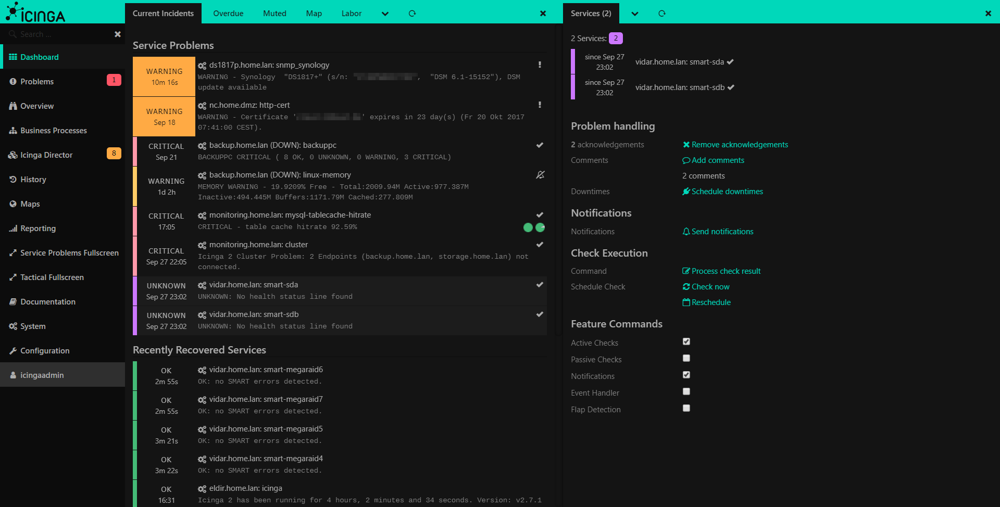
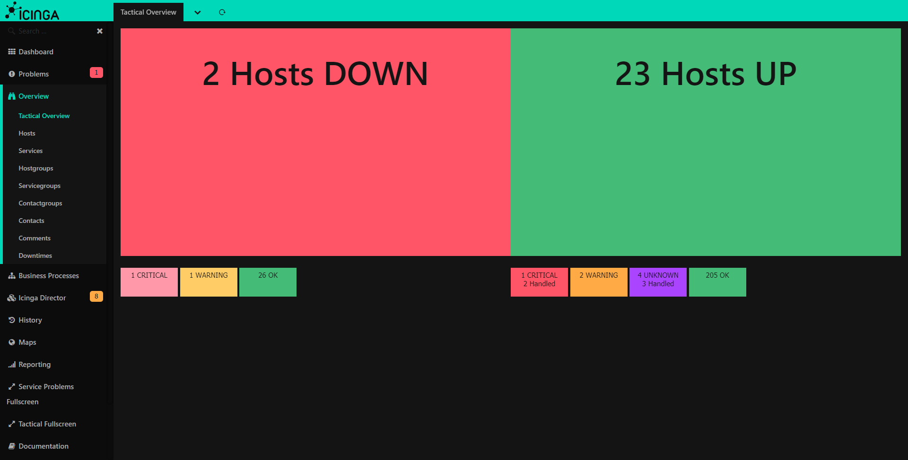
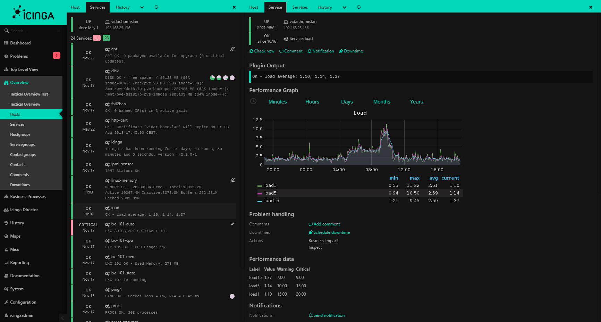
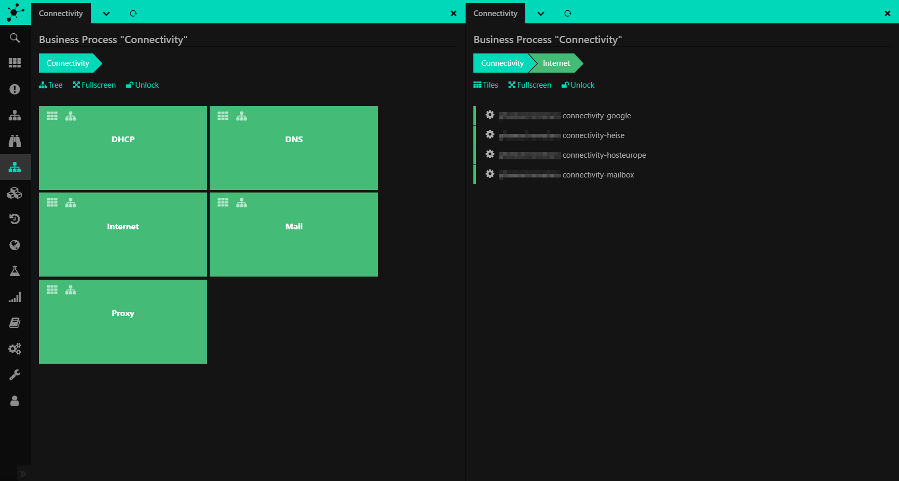
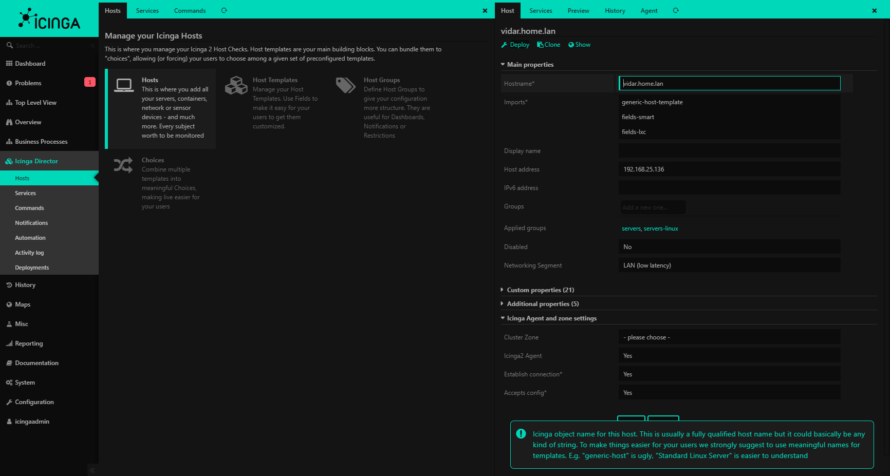

# icingaweb2-module-theme-dark: A dark theme for Icingaweb2

## Description

This is a dark theme for Icingaweb2. For a consistent look it also changes few styles from other modules, like Icinga Director for example.

## How to install

1. Change to the directory `modules`

        # cd /usr/share/icingaweb2/modules

2. Clone this module

        # git clone https://github.com/vita2/icingaweb2-module-theme-dark.git theme-dark

3. Now, open Icingaweb2 in your browser
4. Enable the module (**Configuration** -> **Modules** -> **theme-dark**)

    alternative, it can be done via command line interface:
    
        # icingacli module enable theme-dark

5. Select the new theme in your account settings (**Username** -> **My Account** -> **Theme** -> **theme-dark/Dark**)

Icingaweb2 will instantly switch to the new theme. If not, please try to reload the page.

## Example Screenshots

### Login page

### Dashboard

### Tactical Overview

### Service with Grafana module

### Business Processes module ###

### Icingaweb2 Director module

